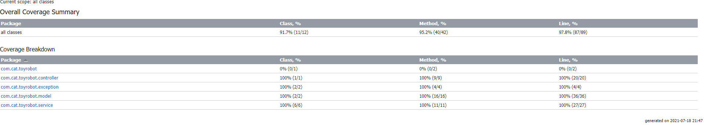
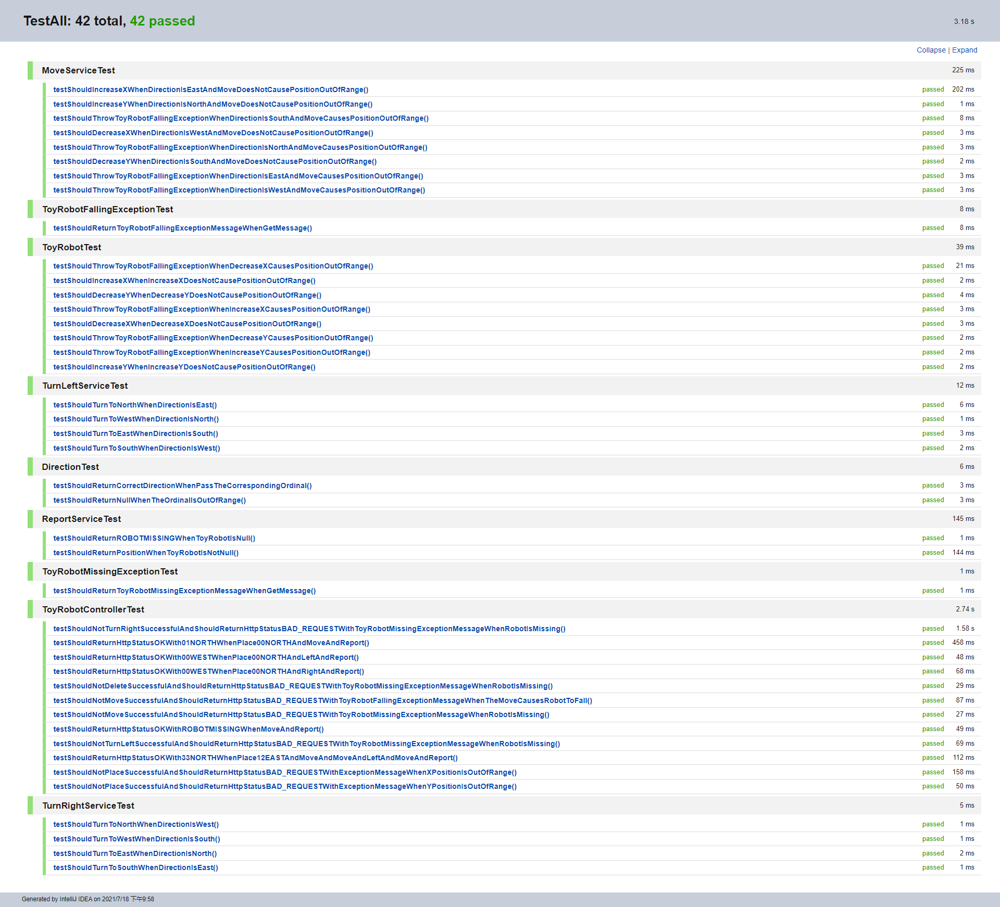

# Toy Robot

This is a Spring-Boot-Application that simulates a toy robot moving on a square table, of dimensions 5 x5 units.


## Quick Start

- Compile: `mvn compile`

- Test: `mvn test`

- Run: `mvn spring-boot:run`

- Package: `mvn package`
------------------------------------------------------------------------------------------

## Use the Application

#### Place

<details>
 <summary><code>POST</code> <code><b>/robot/place</b></code> <code>(Put a toy robot on the table in position x,y and facing NORTH, SOUTH, EAST or WEST.)</code></summary>

##### Data Params

> |  data type     | description               |
> |-----------|-------------------------|
> |  JSON | x: position x, 0<=x<=4<br>y: position y, 0<=y<=4<br>direction: position direction, must be one of "NORTH", "EAST", "SOUTH", "WEST" |


##### Responses

> | http code     | content-type                      | response                                                            |
> |---------------|-----------------------------------|---------------------------------------------------------------------|
> | `201 Created`         | `text/plain;charset=UTF-8`        | None                                |
> | `400 Bad Request`     | `text/plain;charset=UTF-8`        | `Error Message`                   |

##### Example cURL

> ```javascript
>  curl -X POST -H "Content-Type: application/json" --data '{"x":1,"y":1,"direction":"WEST"}' http://localhost:8080/robot/place
> ```

</details>

#### Move
<details>
 <summary><code>PUT</code> <code><b>/robot/move</b></code> <code>(Move the toy robot one unit forward in the direction it is currently facing.)</code></summary>

##### Data Params

None

##### Responses

> | http code     | content-type                      | response                                                            |
> |---------------|-----------------------------------|---------------------------------------------------------------------|
> | `200 OK`         | `text/plain;charset=UTF-8`        | None                                |
> | `400 Bad Request`     | `text/plain;charset=UTF-8`        | `Error Message`                   |

##### Example cURL

> ```javascript
>  curl -X PUT http://localhost:8080/robot/move
> ```

</details>

#### Left
<details>
 <summary><code>PUT</code> <code><b>/robot/left</b></code> <code>(Rotate the robot 90 degrees in the specified direction without changing the position of the robot.)</code></summary>

##### Data Params

None

##### Responses

> | http code     | content-type                      | response                                                            |
> |---------------|-----------------------------------|---------------------------------------------------------------------|
> | `200 OK`         | `text/plain;charset=UTF-8`        | None                                |
> | `400 Bad Request`     | `text/plain;charset=UTF-8`        | `Error Message`                   |

##### Example cURL

> ```javascript
>  curl -X PUT http://localhost:8080/robot/left
> ```

</details>

#### Right
<details>
 <summary><code>PUT</code> <code><b>/robot/right</b></code> <code>(Rotate the robot 90 degrees in the specified direction without changing the position of the robot.)</code></summary>

##### Data Params

None

##### Responses

> | http code     | content-type                      | response                                                            |
> |---------------|-----------------------------------|---------------------------------------------------------------------|
> | `200 OK`         | `text/plain;charset=UTF-8`        | None                                |
> | `400 Bad Request`     | `text/plain;charset=UTF-8`        | `Error Message`                   |

##### Example cURL

> ```javascript
>  curl -X PUT http://localhost:8080/robot/right
> ```

</details>

#### Report
<details>
 <summary><code>GET</code> <code><b>/robot/report</b></code> <code>(Announce the x,y and direction of the robot.)</code></summary>

##### Data Params

None

##### Responses

> | http code     | content-type                      | response                                                            |
> |---------------|-----------------------------------|---------------------------------------------------------------------|
> | `200 OK`         | `text/plain;charset=UTF-8`        | `Robot Position`                                |
> | `400 Bad Request`     | `text/plain;charset=UTF-8`        | `Error Message`                   |

##### Example cURL

> ```javascript
>  curl -X GET http://localhost:8080/robot/report
> ```

</details>

#### Delete
<details>
 <summary><code>DELETE</code> <code><b>/robot/delete</b></code> <code>(Delete the robot)</code></summary>

##### Data Params

None

##### Responses

> | http code     | content-type                      | response                                                            |
> |---------------|-----------------------------------|---------------------------------------------------------------------|
> | `200 OK`         | `text/plain;charset=UTF-8`        | None                                |
> | `400 Bad Request`     | `text/plain;charset=UTF-8`        | `Error Message`                   |

##### Example cURL

> ```javascript
>  curl -X DELETE http://localhost:8080/robot/delete
> ```

</details>

------------------------------------------------------------------------------------------
## High Test Coverage



------------------------------------------------------------------------------------------
## Test Report

